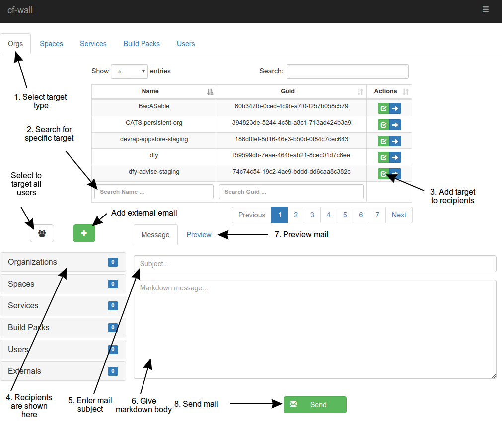

**Table of Contents**

- [Introduction](#introduction)
- [UI](#ui)
- [API](#api)
- [Configuration](#configuration)

# Introduction

**cf-wall** is an application that helps operations to communicate informations
to cloud-foundry users.

- Step 1: select targeted cloud-foundry components
  - organizations
  - spaces
  - buildpacks
  - services
  - users

- Step 2:
  - Write mail subject
  - Write mail body in markdown language

- Step 3: cf-wall deduce recipients from selected targets and
  send mail formatted in html from markdown

# Ui

# API

cf-wall's api is documented [here](./docs/api.md)

# Configuration

See [here](./docs/configuration.md)

<!-- Local Variables: -->
<!-- ispell-local-dictionary: "american" -->
<!-- End: -->
